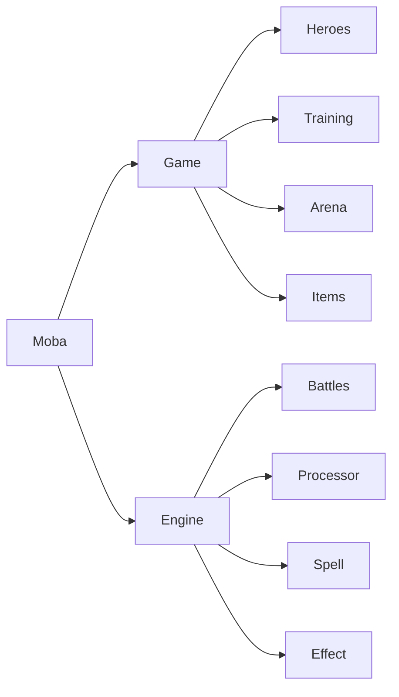

# MOBA - Multiplayer Online Battle Arena


[][discord]

A turn-based RPG built with Phoenix LiveView, online since 2020.

### [`PRESS START`](https://browsermoba.com/)

## Summary

**Stack:** Elixir 1.16 · Phoenix 1.7 · LiveView 0.20 · PostgreSQL

**Gameplay:** 20 avatars · 20+ skills · 25+ items · 7 league tiers · 1v1 duels · 5v5 matches

---

## Technical Highlights

### Domain-Driven Architecture

`Game` orchestrates all gameplay modules. `Engine` orchestrates all battle-related modules. Both use `defdelegate` to expose clean public APIs.



**Key files:**
- [`lib/moba.ex`](lib/moba.ex) — Cross-domain orchestration
- [`lib/moba/game.ex`](lib/moba/game.ex) — Gameplay orchestrator
- [`lib/moba/engine.ex`](lib/moba/engine.ex) — Battle orchestrator

---

### Composable Battle Engine

Skills and items are defined as chains of small, pure effect functions. The `Spell` module uses pattern matching as a DSL for skill definitions.


**Key files:**
- [`lib/moba/engine/core/processor.ex`](lib/moba/engine/core/processor.ex) — Turn processing pipeline
- [`lib/moba/engine/core/spell.ex`](lib/moba/engine/core/spell.ex) — Skill/item definitions via pattern matching
- [`lib/moba/engine/core/effect.ex`](lib/moba/engine/core/effect.ex) — Composable effect functions

**Why this pattern:**
- Adding new skills requires only new function clauses
- Effects are pure functions, easy to test in isolation
- Battle logic completely decoupled from persistence

---

## Features

- **Hero Building** — Choose from 20 avatars, 20+ abilities, and 25+ items to train your custom hero
- **PvE Training** — Battle through 7 leagues and a boss fight to compete for the fastest completion time
- **Account Progression** — Master all playstyles with full account leveling and season leaderboards
- **Competitive PvP** — 5v5 team battles with skill brackets and 1v1 real-time duels

---

## Setup

```bash
mix deps.get
mix ecto.setup
cd assets && npm install && cd ..
mix phx.server
```

Visit [`localhost:4000`](http://localhost:4000). Admin login: `admin@browsermoba.com` / `123456`

### Tests

```bash
MIX_ENV=test mix ecto.setup
mix test
```

[discord]: https://discord.gg/QNwEdPS
